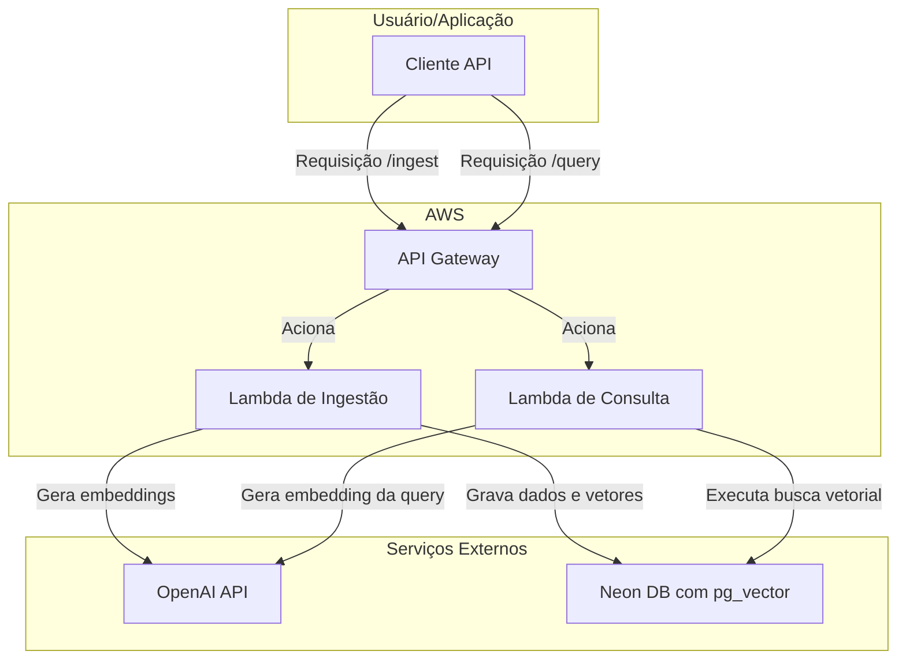

# *Sua Base de Conhecimento Inteligente como Serviço (KBaaS)*

-----

## Sumário

1.  [Visão Geral](https://www.google.com/search?q=%231-vis%C3%A3o-geral)
2.  [Arquitetura da Solução](https://www.google.com/search?q=%232-arquitetura-da-solu%C3%A7%C3%A3o)
3.  [Fluxo de Dados](https://www.google.com/search?q=%233-fluxo-de-dados)
      * [Fluxo de Ingestão](https://www.google.com/search?q=%23a-fluxo-de-ingest%C3%A3o-indexa%C3%A7%C3%A3o)
      * [Fluxo de Consulta](https://www.google.com/search?q=%23b-fluxo-de-consulta-busca-sem%C3%A2ntica)
4.  [Modelo de Dados no Neon](https://www.google.com/search?q=%234-modelo-de-dados-no-neon)
5.  [Documentação da API](https://www.google.com/search?q=%235-documenta%C3%A7%C3%A3o-da-api)
      * [`POST /knowledge-bases`](https://www.google.com/search?q=%23endpoint-1-post-knowledge-bases)
      * [`POST /ingest`](https://www.google.com/search?q=%23endpoint-2-post-ingest)
      * [`POST /query`](https://www.google.com/search?q=%23endpoint-3-post-query)
6.  [Guia de Início Rápido](https://www.google.com/search?q=%236-guia-de-in%C3%ADcio-r%C3%A1pido)
7.  [Vantagens e Diferenciais](https://www.google.com/search?q=%237-vantagens-e-diferenciais)
8.  [Roadmap Futuro](https://www.google.com/search?q=%238-roadmap-futuro)
9.  [Estratégia de CI/CD](https://www.google.com/search?q=%239-estrat%C3%A9gia-de-cicd-automa%C3%A7%C3%A3o-de-infraestrutura-e-deploy)

-----

## 1\. Visão Geral

**Cortexa** é uma plataforma de API que transforma seus documentos estáticos e dados não estruturados em uma base de conhecimento interativa e pesquisável. Com uma simples chamada de API, você pode ingerir conteúdo e, em seguida, fazer perguntas em linguagem natural para encontrar as informações mais relevantes.

O serviço foi projetado para desenvolvedores e empresas que desejam incorporar busca semântica, sistemas de Q\&A (Perguntas e Respostas) ou assistentes inteligentes em suas próprias aplicações sem a complexidade de gerenciar a infraestrutura de IA e bancos de dados vetoriais.

### Principais Funcionalidades

  * **API-First:** Todos os recursos são expostos através de uma API RESTful simples e intuitiva.
  * **Busca Semântica:** Encontre resultados com base no significado e contexto, não apenas em palavras-chave.
  * **Ingestão Simplificada:** Envie seu conteúdo de texto e o Cortexa cuida do resto (divisão, vetorização e armazenamento).
  * **Arquitetura Serverless:** Custo-benefício extremo, com um custo real de zero quando não há uso.
  * **Multi-Tenant:** Crie e gerencie múltiplas bases de conhecimento isoladas para diferentes clientes ou projetos.

## 2\. Arquitetura da Solução

Cortexa é construído sobre uma pilha de tecnologias modernas, "best-of-breed" e totalmente serverless, garantindo escalabilidade, resiliência e um modelo de custo pay-per-use real.



### Detalhamento dos Componentes:

  * **API Gateway (AWS):** Atua como o ponto de entrada para todas as requisições. Gerencia autenticação (API Keys), roteamento para as funções Lambda corretas, throttling e segurança.
  * **AWS Lambda:** O coração da nossa lógica de negócio.
      * **Lambda de Ingestão:** Responsável por processar novos conteúdos, chamar a API da OpenAI para criar embeddings e salvar os dados no Neon.
      * **Lambda de Consulta:** Recebe a pergunta do usuário, gera seu embedding e consulta o Neon para encontrar os resultados mais relevantes.
  * **OpenAI API:** O cérebro da inteligência. Usamos o modelo `text-embedding-3-small` para transformar pedaços de texto (chunks) e perguntas em representações vetoriais de alta qualidade.
  * **Neon (Postgres Serverless):** Nossa camada de persistência. Utilizamos uma instância Neon com a extensão `pg_vector` para armazenar tanto os textos originais quanto seus embeddings vetoriais. Sua capacidade de escalar a zero é fundamental para nosso modelo de custo.

## 3\. Fluxo de Dados

### a) Fluxo de Ingestão (Indexação)

1.  **Requisição:** O cliente envia uma requisição `POST /ingest` contendo o texto a ser adicionado e o ID da base de conhecimento.
2.  **Roteamento:** A API Gateway autentica a requisição e aciona a `Lambda de Ingestão`.
3.  **Processamento:** A Lambda divide o texto recebido em pedaços menores e otimizados (chunks).
4.  **Vetorização:** Para cada chunk, a Lambda faz uma chamada para a API da OpenAI, que retorna um vetor de embedding.
5.  **Armazenamento:** A Lambda se conecta ao Neon e insere cada chunk de texto junto com seu vetor correspondente na tabela apropriada.

### b) Fluxo de Consulta (Busca Semântica)

1.  **Requisição:** O cliente envia uma requisição `POST /query` com a pergunta em linguagem natural e o ID da base de conhecimento.
2.  **Roteamento:** A API Gateway aciona a `Lambda de Consulta`.
3.  **Vetorização da Pergunta:** A Lambda envia a pergunta do usuário para a API da OpenAI para gerar seu vetor de embedding.
4.  **Busca Vetorial:** A Lambda executa uma query no Neon usando `pg_vector`. A query calcula a distância de cosseno entre o vetor da pergunta e todos os vetores na base de conhecimento especificada, retornando os `k` mais próximos.
5.  **Resposta:** A Lambda formata os resultados (os textos dos chunks mais relevantes) e os retorna ao cliente.

## 4\. Modelo de Dados no Neon

Utilizamos uma tabela principal para armazenar os chunks de conhecimento. A coluna `knowledge_base_id` é crucial para garantir o isolamento dos dados de diferentes clientes (multi-tenancy).

```sql
-- Habilitar a extensão pg_vector
CREATE EXTENSION IF NOT EXISTS vector;

-- Tabela para armazenar as bases de conhecimento (tenants)
CREATE TABLE knowledge_bases (
    id UUID PRIMARY KEY DEFAULT gen_random_uuid(),
    name VARCHAR(255) NOT NULL,
    user_id UUID NOT NULL, -- Referência ao dono da base de conhecimento
    created_at TIMESTAMPTZ DEFAULT NOW()
);

-- Tabela principal para os chunks de dados e seus vetores
CREATE TABLE knowledge_chunks (
    id UUID PRIMARY KEY DEFAULT gen_random_uuid(),
    knowledge_base_id UUID NOT NULL REFERENCES knowledge_bases(id) ON DELETE CASCADE,
    content TEXT NOT NULL,
    embedding VECTOR(1536) NOT NULL, -- Dimensão para text-embedding-3-small
    metadata JSONB,
    created_at TIMESTAMPTZ DEFAULT NOW()
);

-- Criar um índice para acelerar a busca por similaridade
-- O tipo de índice (aqui, IVFFlat) pode ser ajustado conforme o volume de dados
CREATE INDEX ON knowledge_chunks USING ivfflat (embedding vector_cosine_ops)
WITH (lists = 100);
```

## 5\. Documentação da API

**URL Base:** `https://api.issei.com.br/cortexa/v1`

### Endpoint 1: `POST /knowledge-bases`

Cria uma nova base de conhecimento.

  * **Request Body:**
    ```json
    {
      "name": "Documentação Interna do Produto X"
    }
    ```
  * **Success Response (201):**
    ```json
    {
      "id": "a1b2c3d4-e5f6-7890-1234-567890abcdef",
      "name": "Documentação Interna do Produto X",
      "createdAt": "2025-09-03T12:00:00Z"
    }
    ```

### Endpoint 2: `POST /ingest`

Adiciona conteúdo a uma base de conhecimento existente.

  * **Request Body:**
    ```json
    {
      "knowledgeBaseId": "a1b2c3d4-e5f6-7890-1234-567890abcdef",
      "text": "O Módulo de Faturamento permite a criação de faturas recorrentes. Para configurar, acesse o painel de administração e clique em 'Faturamento Recorrente'."
    }
    ```
  * **Success Response (202):**
    ```json
    {
      "status": "accepted",
      "message": "O conteúdo está sendo processado e estará disponível em breve."
    }
    ```

### Endpoint 3: `POST /query`

Realiza uma busca semântica em uma base de conhecimento.

  * **Request Body:**
    ```json
    {
      "knowledgeBaseId": "a1b2c3d4-e5f6-7890-1234-567890abcdef",
      "query": "como eu crio faturas recorrentes?",
      "top_k": 3
    }
    ```
  * **Success Response (200):**
    ```json
    {
      "results": [
        {
          "content": "O Módulo de Faturamento permite a criação de faturas recorrentes. Para configurar, acesse o painel de administração e clique em 'Faturamento Recorrente'.",
          "score": 0.912,
          "metadata": null
        },
        {
          "content": "As faturas podem ser customizadas com o logo da empresa nas configurações de Faturamento.",
          "score": 0.854,
          "metadata": null
        }
      ]
    }
    ```

## 6\. Guia de Início Rápido

**Pré-requisitos:** Você precisa da sua `CORTEXA_API_KEY`.

### Passo 1: Criar uma Base de Conhecimento

```bash
curl -X POST [https://api.issei.com.br/cortexa/v1/knowledge-bases](https://api.issei.com.br/cortexa/v1/knowledge-bases) \
  -H "Authorization: Bearer $CORTEXA_API_KEY" \
  -H "Content-Type: application/json" \
  -d '{
        "name": "Meu Primeiro Projeto"
      }'
# Salve o "id" retornado. Vamos chamá-lo de KB_ID.
```

### Passo 2: Ingerir seu primeiro documento

```bash
KB_ID="seu-id-aqui"
curl -X POST [https://api.issei.com.br/cortexa/v1/ingest](https://api.issei.com.br/cortexa/v1/ingest) \
  -H "Authorization: Bearer $CORTEXA_API_KEY" \
  -H "Content-Type: application/json" \
  -d '{
        "knowledgeBaseId": "'"$KB_ID"'",
        "text": "Cortexa é um serviço de base de conhecimento inteligente. Ele usa a API da OpenAI para vetorizar textos e o Neon DB para armazená-los."
      }'
```

### Passo 3: Fazer uma pergunta

```bash
KB_ID="seu-id-aqui"
curl -X POST [https://api.issei.com.br/cortexa/v1/query](https://api.issei.com.br/cortexa/v1/query) \
  -H "Authorization: Bearer $CORTEXA_API_KEY" \
  -H "Content-Type: application/json" \
  -d '{
        "knowledgeBaseId": "'"$KB_ID"'",
        "query": "quais tecnologias o cortexa usa?",
        "top_k": 1
      }'
```

## 7\. Vantagens e Diferenciais

  * **Custo Zero em Inatividade:** Graças ao Neon e AWS Lambda, se sua aplicação não tiver tráfego, os custos de infraestrutura são efetivamente nulos.
  * **Inteligência de Ponta:** Ao utilizar os modelos mais recentes da OpenAI, garantimos resultados de busca de alta relevância.
  * **Flexibilidade do SQL:** Armazenar vetores no Postgres (Neon) nos permite, no futuro, combinar a busca semântica com filtros de metadados estruturados usando SQL padrão.
  * **Simplicidade e Foco:** Como um serviço de API, abstraímos toda a complexidade da IA e da infraestrutura, permitindo que nossos clientes foquem em suas aplicações.

## 8\. Roadmap Futuro
      * Suporte a ingestão de arquivos (PDF, DOCX, TXT) via upload.
      * Endpoint de RAG (Retrieval-Augmented Generation) que retorna uma resposta em linguagem natural, não apenas os chunks de texto.
      * Suporte a filtragem avançada por metadados na API de consulta.
      * SDKs em Python e JavaScript.
      * Opção de escolher diferentes modelos de embedding.

## 9\. Estratégia de CI/CD (Automação de Infraestrutura e Deploy)

  * **Visão Geral:** A infraestrutura e o deploy do Cortexa são totalmente automatizados para garantir consistência, segurança e agilidade. Utilizamos uma abordagem de Infraestrutura como Código (IaC) e integração/entrega contínua.
  * **Repositório do Projeto:** O código-fonte, a configuração da infraestrutura e os workflows de CI/CD estão centralizados no GitHub: **[https://github.com/issei/Cortexa](https://github.com/issei/Cortexa)**.
  * **Ferramentas Principais:**
      * **Terraform:** Usado para provisionar e gerenciar toda a infraestrutura na AWS (API Gateway, Funções Lambda, roles IAM, etc.). Os arquivos de configuração do Terraform (`.tf`) definem o estado desejado da nossa nuvem, permitindo criar, modificar e destruir ambientes de forma previsível.
      * **GitHub Actions:** Orquestra todo o ciclo de vida do deploy. Workflows automatizados são acionados em eventos como `push` para a branch `main` ou criação de `pull requests`.
  * **Assistente de Desenvolvimento (Jules.Google):** Para acelerar o desenvolvimento e a manutenção, contamos com o apoio do Jules.Google. Ele auxilia na geração de código boilerplate para as Lambdas, na escrita de testes unitários, na otimização de configurações do Terraform e na depuração de workflows do GitHub Actions, atuando como um "pair programmer" de IA.
  * **Fluxo de CI/CD:**
    1.  **Desenvolvimento:** Um desenvolvedor faz alterações no código da Lambda ou na configuração do Terraform em uma branch de feature.
    2.  **Pull Request (PR):** Ao abrir um PR para a branch `main`, um workflow do GitHub Actions é acionado para:
          * Executar testes unitários e de integração.
          * Executar `terraform plan` para mostrar as mudanças que serão aplicadas na infraestrutura, postando o resultado como um comentário no PR.
    3.  **Merge:** Após a aprovação e o merge do PR na `main`, outro workflow é acionado para:
          * Empacotar o código da aplicação (ex: `zip` para a Lambda).
          * Executar `terraform apply` para provisionar as mudanças na infraestrutura da AWS.
          * Fazer o deploy da nova versão da função Lambda.